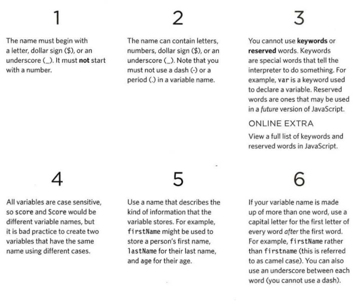

# Basics of HTML, CSS & JS

## Text

When creating a web page, you add tags (known as markup) to the contents of the page.These elements are used to describe the structure of the page.

1. Structural markup: the elements that you can use to describe both headings and paragraphs.

* Headings

> HTML has six "levels" of headings:
> `<h1>` : is used for main headings.
> `<h2>` : is used for subheadings.
> `<h3>,<h4>,<h5>,<h6>` : is used for further sections under the subheadings.

* Paragraphs

> `<p>` : To create a paragraph, surround the words that make up the paragraph with an opening <p> tag and closing `</p>` tag.

* Bold & Italic

> `<b>` : By enclosing words in the tags `<b>` and `</b>` we can make characters appear bold.

> `<i>` : By enclosing words in the tags `<i>` and `</i>` we can make characters appear italic.

* Superscript & Subscript

> `<sup>` : The `<sup>` element is used to contain characters that should be superscript such as the suffixes of dates or mathematical concepts like raising a number to a power.

> `<sub>` : The `<sub>` element is used to contain characters that should be subscript. It is commonly used with foot notes or chemical formulas.

* White Space

> When the browser comes across two or more spaces next to each other, it only displays one space.

* Line Breaks & Horizontal Rules

> `<br />` : is used for add a line break inside the middle of a paragraph.

> `<hr />` : is used for add a horizontal rule between sections to create a break between themes.

2. Semantic markup: which provides extra information; that are not intended to affect the
structure of your web pages.

* Strong & Emphasis

> `<strong>` : The use of the `<strong>` element indicates that its content has strong importance.

> `<em>` : The `<em>` element indicates emphasis that subtly changes the meaning of a sentence.

* Quotations

> `<blockquote>` : is used for longer quotes that take up an entire paragraph.

> `<q>` : is used for shorter quotes that sit within a paragraph. Browsers are supposed to put quotes around the `<q>` element.

* Abbreviations & Acronyms

> `<abbr>` : is used to specify the full term.

> `<acronym>` To spell out the full form of the acronym.

* Citations & Definitions

> `<cite>` : is used to indicate where the citation is from.

> `<dfn>` : is used to indicate the defining instance of a new term.

* Auth or Details

> `<address>` : is used to contain contact details for the author of the page. It can contain a physical address, but it does not have to.

* Changes to Content

> `<ins>` : is used to show content that has been inserted into a document.

> `<del>` : is used to show text that has been deleted from it.

> `<s>` : The `<s>` element indicates something that is no longer accurate or relevant (but that should not be deleted).

## Introducing CSS

**CSS** allows you to create rules that specify how the content of an element should appear,make your web pages more attractive.

**CSS** works by associating rules with HTML elements. These rules govern how the content of specified elements should be displayed. A CSS rule contains two parts: a **selector**(that specify then elements the rule applies to) and a **declaration**(that indicate what these elements should look like).

**CSS** declarations sit inside curly brackets and each is made up of two parts: a **property** and a **value**, separated by a colon.You can specify several properties in one declaration, each separated by a semi-colon.

* CSS Selectors

Selector | Meaning | Example
------------ | ------------- | -------------
Universal Selector  | Applies to all elements in the document   |   * {} Targets all elements on the page
Type Selector  | Matches element names   |  h1, h2, h3 {} Targets the `<h1>, <h2>` and `<h3>` elements
Class Selector  | Matches an element whose class attribute has a value that matches the one specified after the period (or full stop) symbol   |   .note {} Targets any element whose class attribute has a value of note p.note {} Targets only `<p>` elements whose class attribute has a value of note
ID Selector  | Matches an element whose id attribute has a value that matches the one specified after the pound or hash symbol   |   #introduction {} Targets the element whose id attribute has a value of introduction
Chil d Selector  | Matches an element that is a direct child of another   |   li>a {} Targets any `<a>` elements that are children of an `<li>` element (but not other `<a>` elements in the page)
Descendant Selector  | Matches an element that is a descendent of another specified element (not just a direct child of that element)   |   p a {} Targets any `<a>` elements that sit inside a `<p>` element, even if there are other elements nested between them
Adjacent Sibling Selector  | Matches an element that is the next sibling of another   |   h1+p {} Targets the first `<p>` element after any `<h1>` element (but not other `<p>` elements)
General Sibling Selector  | Matches an element that is a sibling of another, although it does not have to be the directly preceding element   |   h1~p {} If you had two `<p>` elements that are siblings of an `<h1>` element, this rule would apply to both

## Basic JavaScript Instructions

* STATEMENTS

> A script is a series of instructions that a computer can follow one-by-one. Each individual instruction or step is known as a **statement**. Statements should end with a semicolon.

* COMMENTS

> You should write **comments** to explain what your code does. They help make your code easier to read and understand. This can help you and others who read your code.

* MULTI-LINE COMMENTS 
   * To write a ** comment ** that stretches over more than one line, you use a multi-line   comment, starting with the ```/* characters and ending with the */ ```characters. Anything between these characters is not processed· by the ** JavaScript ** interpreter.


* SINGLE-LINE COMMENTS 
   * In a single-line ** comment ** , anything that follows the two forward slash characters ```//``` on that line will not be processed by the JavaScript interpreter. Singleline comments are often used for short descriptions of what the code is doing.  

**WHAT IS A VARIABLE?**

> A script will have to temporarily store the bits of information it needs to do its job. It can store this data in ** variables **. 

**RULES FOR NAMING VARIABLES**

* Here are six rules you must always follow when giving a variable a name: 
  

# Comparison and Logical Operators

* Comparison and Logical operators are used to test for ** true **  or ** false **.

## Comparison Operators

* Comparison operators are used in logical statements to determine equality or difference between variables or values.

Operator | Description
------------ | -------------
==	| equal to	
===	 | equal value and equal type	
!=	 | not equal	
!==| not equal value or not equal type
> | greater than	
<	 | less than	
>= | 	greater than or equal to
<= | less than or equal to

** How Can it be Used **
>Comparison operators can be used in conditional statements to compare values and take action depending on the result

## Logical Operators

* Logical operators are used to determine the logic between variables or values.

1. &&	- **and**	
> true && true returns true
> true && false returns false
> false && true returns false
> false && false returns false
2. || - **or**	
> true || true returns true
> true || false returns true
> false || true returns true
> false || false returns false
3. !	-  **not**
> !true returns false
> !false returns true

## Loops

** Loops are handy, if you want to run the same code over and over again, each time with a different value.**

* Different Kinds of Loops
  * JavaScript supports different kinds of loops:

1. **for** - loops through a block of code a number of times

> The for loop if you need to run a code a specific number of time.

2. **while** - loops through a block of code while a specified condition is true

> The while loop loops through a block of code as long as a specified condition is true.

3. **do/while** - also loops through a block of code while a specified condition is true

> The do/while loop is a variant of the while loop. This loop will execute the code block once, before checking if the condition is true, then it will repeat the loop as long as the condition is true.