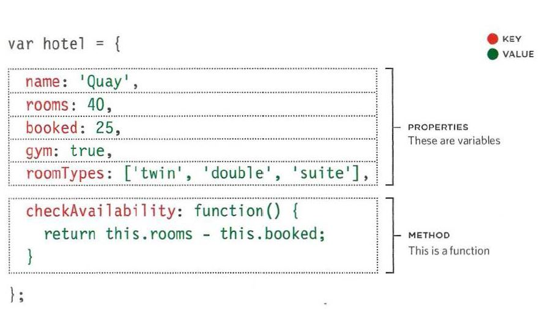
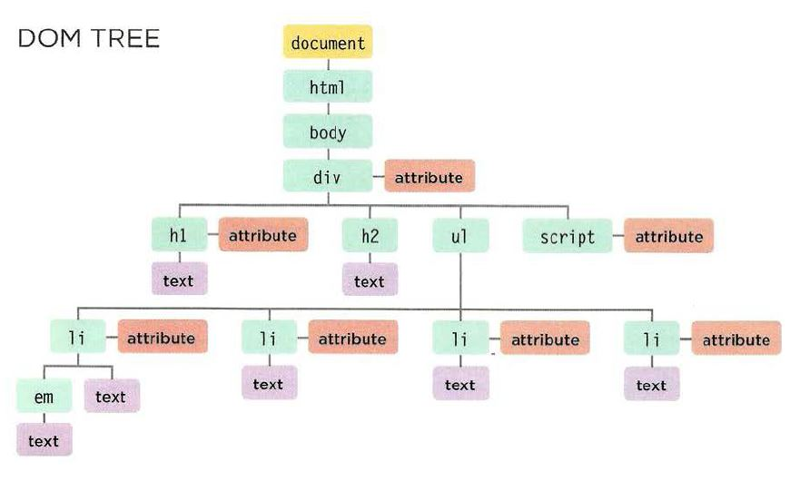

# JS Object

## WHAT IS AN OBJECT?

Objects group together a set of variables and functions to create a model of a something you would recognize from the real world. In an object, variables and functions take on new names.

> IN AN OBJECT: VARIABLES BECOME KNOWN AS PROPERTIES

> IN AN OBJECT: FUNCTIONS BECOME KNOWN AS METHODS

Like variables and named functions, properties and methods have a name and a value. In an object, that name is called a key.

> An object cannot have two keys with the same name. This is because keys are used to access their corresponding values.

The value of a property can be a string, number, Boolean, array, or even another object. The value of a method is always a function.

# The Document Object Model (DOM)

The DOM is neither part of HTML, or part of JavaScript; it is a separate set of rules. It is implemented by all major browser makers, and covers two primary areas:

1. MAKING A MODEL OF THE HTML PAGE

2. ACCESSING AND CHANGING THE HTML PAGE

## THE DOM TREE IS A MODEL OF A WEB PAGE

> As a browser loads a web page, it creates a model of that page. The model is called a DOM tree, and it is stored in the browsers' memory. It consists of four main types of nodes.

> DOM trees have four types of nodes:

* document nodes,
* element nodes,
* attribute nodes,
* and text nodes.

**Accessing and updating the DOM tree involves two steps:**

1. Locate the node that represents the element you want to work with.

2. Use its text content, child elements, and attributes.

---------------

You can select element nodes by their **id or class attributes**, by tag name, or using CSS selector syntax.

Whenever a DOM query can return more than one node, it will always return a **NodeList**.

From an element node, you can access and update its content using properties such as **textContent** and **innerHTML** or using DOM manipulation techniques.

An element node can contain multiple text nodes and child elements that are siblings of each other.

> Browsers offer tools for viewing the DOM tree.
