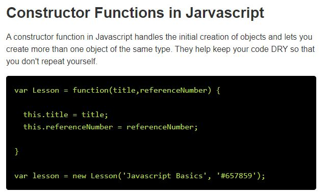

# HTML Tables

There are several types of information that need to be displayed in a grid or table.

## What's a Table?

A table represents information in a grid format.

> Grids allow us to understand complex data by referencing information on two axes.

Examples of tables include financial reports, TV schedules, and sports results.

## Basic Table Structure

`<table>`

The `<table>` element is used to create a table. The contents of the table are written out row by row.

`<tr>`

You indicate the start of each row using the opening `<tr>` tag.(The tr stands for table row.)

`<td>`

Each cell of a table is represented using a `<td>` element. (The td stands for table data.)

## Table Headings

`<th>`

The `<th>` element is used just like the `<td>` element but its purpose is to represent the heading for either a column or a row. (The th stands for table heading.)

> You can make cells of a table span more than one row or column using the rowspan and colspan attributes.

## Long Tables

`<thead>`

The headings of the table should sit inside the `<thead>` element.

`<tbody>`

The body should sit inside the `<tbody>` element.

`<tfoot>`

The footer belongs inside the `<tfoot>` element.

# JS Constructor Functions

* Constructor Functions have two type of elemets: properties and methods.

* A property is a variable and is consider the data of the object.

A method is a function(built-in or created)that is called from within the object.

-------------------------------
The first thing you need to do is get to know what tools are available. You can imagine that your new toolkit has three compartments:

1. BROWSER OBJECT MODEL

The Browser Object Model contains objects that represent the current browser window or tab. It contains objects that model things like browser history and the device's screen.

2. DOCUMENT OBJECT MODEL

The Document Object Model uses objects to create a representation of the current page. It creates a new object for each element (and each individual section of text) within the page.

3. GLOBAL JAVASCRIPT OBJECTS

The global JavaScript objects represent things that the JavaScript language needs to create a model of. For example, there is an object that deals only with dates and times.

