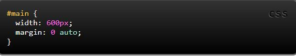

# Layout

**display** is *CSS's* most important property for controlling layout. Every element has a default display value depending on what type of element it is. The default for most elements is usually **block** or **inline**. A block element is often called a block-level element. An inline element is always just called an inline element.

## Key Concepts in Positioning Elements

**Building Blocks**

CSS treats each HTML element as if it is in its own box. This box will either be a block-level box or an inline box.

* Block-level element

start on a new line

> Examples include: `<h1> 
 <ul> <li>`

* Inline elements

flow in between surrounding text

> Examples include: ` <b> <i>`
----

Setting the width of a block-level element will prevent it from stretching out to the edges of its container to the left and right. Then, you can set the left and right margins to auto to horizontally center that element within its container. The element will take up the width you specify, then the remaining space will be split evenly between the two margins.

**Containing Elements**

If one block-level element sits inside another block-level element then the outer box is known as the containing or parent element.

## Controlling the Position of Elements

CSS has the following positioning schemes that allow you to control the layout of a page: normal flow, relative positioning, and absolute positioning.

1. Normal flow

Every block-level element appears on a new line, causing each item to appear lower down the page than the previous one.

2. Relative Positioning

This moves an element from the position it would be in normal flow, shifting it to the top, right, bottom, or left of where it would have been placed.

3. Absolute positioning

This positions the element in relation to its containing element. It is taken out of normal flow, meaning that it does not affect the position of any surrounding elements (as they simply ignore the space it would have taken up).

> Another CSS property used for layout is `float`. **Float** is intended for wrapping text around images.

> The `clear` property is important for controlling the behavior of floats.

**box offset**

properties to tell the browser how far from the top or bottom and left or right it should be placed.

Fixed Positioning

Floating Elements

-----

> `
` elements are often used as containing elements to group together sections of a page.

> Browsers display pages in normal flow unless you specify relative, absolute, or fixed positioning.

> The float property moves content to the left or right of the page and can be used to create multi-column layouts. (Floated items require a defined width.)

> Pages can be fixed width or liquid (stretchy) layouts.

> Grids help create professional and flexible designs.

> CSS Frameworks provide rules for common tasks.

> You can include multiple CSS files in one page.