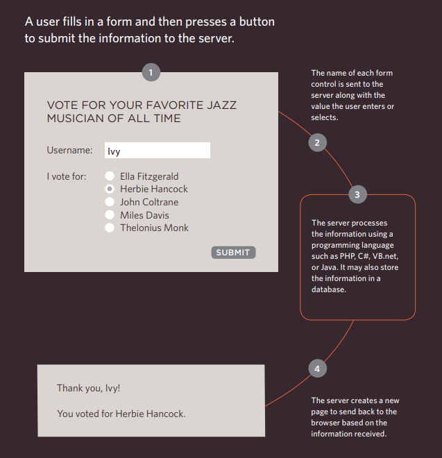

# Forms and JS Events

## Forms

Traditionally, the term **'form'** has referred to a printed document that contains spaces for you to fill in information.

> You will see forms when registering as a member of a website, when shopping online, and when signing up for newsletters or mailing lists.

### Form Controls

There are several types of form controls that you can use to collect information from visitors to your site.

1. ADDING TEXT:

* Text input (single-line)

Used for a single line of text such as email addresses and names.

* Password input

Like a single line text box but it masks the characters entered.

* Text area (multi-line)

For longer areas of text, such as messages and comments.

2. Making choices:

* Radio buttons

For use when a user must select one of a number of options.

* Checkboxes

When a user can select and unselect one or more options.

* Drop-down boxes

When a user must pick one of a number of options from a list.

3. Submitting Forms:

* Submit buttons

To submit data from your form to another web page.

* Image buttons

Similar to submit buttons but they allow you to use an image.

4. Uploading Files:

* File upload

Allows users to upload files (e.g. images) to a website.

### How Forms Work

> A form may have several form controls, each gathering different information.

`username(name)=Ivy(value)`.

### Form Structure

*`<form>`* element.

This element should always carry the action attribute and will usually have a method and id attribute too.

*`action`*

Its value is the URL for the page on the server that will receive the information in the form when it is submitted.

*`method`*

using one of two methods:

1. **get**

2. **post**

> HTML5 introduces new form elements which make it easier for visitors to fill in forms.

## Lists, Tables and Forms

There are several CSS properties that were created to work with specific types of HTML elements, such as lists, tables, and forms.

**List markers can be given different appearances using the list-style-type and list-style image properties.**

* *list-style-type*

The list-style-type property allows you to control the shape or style of a bullet point (also known as a marker).

> It can be used on rules that apply to the `<ol>, <ul>,` and `<li>` elements.

     Unordered Lists

For an unordered list you can use the following values:

 `none, disc, circle, square.`

    Ordered Lists

For an ordered (numbered) list you can use the following values:

`decimal`
1 2 3

`decimal-leading-zero`
01 02 03

`lower-alpha`
a b c

`upper-alpha`
A B C

`lower-roman`
i. ii. iii.

`upper-roman`
I II III

* *list-style-image*

You can specify an image to act as a bullet point using the list-style-image property.

> Table cells can have different borders and spacing in different browsers, but there are properties you can use to control them and make them more consistent.

    Forms are easier to use if the form controls are vertically aligned using CSS

----

## Events

Events are the browser's way of indicating when something has happened (such as when a page has finished loading or a button has been clicked).

### DIFFERENT EVENT TYPES

**UI EVENTS**

EVENT | DESCRIPTION
------------ | -------------
load | Web page has finished loading
unload | Web page is unloading (usually because a new page was requested)
error | Browser encounters a JavaScript error or an asset doesn't exist
resize | Browser window has been resized
scroll | User has scrolled up or down the page

**KEYBOARD EVENTS**

EVENT | DESCRIPTION
------------ | -------------
keydown | User first presses a key (repeats while key is depressed)
keyup | User releases a key
keypress | Character is being inserted (repeats while key is depressed)

**MOUSE EVENTS**

EVENT | DESCRIPTION
------------ | -------------
click | User presses and releases a button over the same element
dbl click | User presses and releases a button twice over the same element
mousedown | User presses a mouse button while over an element
mouseup | User releases a mouse button while over an element
mousemove | User moves the mouse (not on a touchscreen)
mouseover | User moves the mouse over an element (not on a touchscreen)
mouseout | User moves the mouse off an element (not on a touchscreen)

> Binding is the process of stating which event you are waiting to happen, and which element you are waiting for that event to happen upon.

> When an event occurs on an element, it can trigger a JavaScript function. When this function then changes the web page in some way, it feels interactive because it has responded to the user.

> You can use event delegation to monitor for events that happen on all of the children of an element.

> The most commonly used events are W3C DOM events, although there are others in the HTMLS specification as well as browser-specific events.