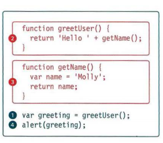

# ERROR HANDLING & DEBUGGING

JavaScript can be hard to learn and everyone makes mistakes when writing it.

> how to find the errors in your code.

> how to write scripts that deal with potential errors gracefully.

## ORDER OF EXECUTION

To find the source of an error, it helps to know how scripts are processed.The order in which statements are executed can be complex; some tasks cannot complete until another statement or function has been run

## EXECUTION CONTEXT & HOISTING

Each time a script enters a new execution context, there are two phases of activity:

1. PREPARE

* The new scope is created

* Variables, functions, and arguments are created

* The value of the this keyword is determined

2. EXECUTE

* Now it can assign values to variables

* Reference functions and run their code

* Execute statements

## UNDERSTANDING SCOPE

In the interpreter, each execution context has its own variables object.

It holds the variables, functions, and parameters available within it.

Each execution context can also access its parent's variables object.

## UNDERSTANDING ERRORS

If a JavaScript statement generates an error, then it throws an exception.

At that point, the interpreter stops and looks for exception-handling code.

## ERROR OBJECTS

Error objects can help you find where your mistakes are and browsers have tools to help you read them.

When an Error object is created, it will contain the following properties:

PROPERTY | DESCRIPTION
------------ | -------------
name | Type of execution
message | Description
fileNumber | Name of the JavaScript file
lineNumber | Line number of error

OBJECT | DESCRIPTION
------------ | -------------
Error | Generic error - the other errors are all based upon this error
Syntax Error | Syntax has not been followed
ReferenceError | Tried to reference a variable that is not declared/within scope
TypeError | An unexpected data type that cannot be coerced
Range Error | Numbers not in acceptable range
URI Error | encodeURI ().decodeURI(),and similar methods used incorrectly
EvalError | eval () function used incorrectly

## HOW TO DEAL WITH ERRORS

1. DEBUG THE SCRIPT TO FIX ERRORS

If you come across an error while writing a script (or when someone reports a bug), you will need to debug the code, track down the source of the error, and fix it.

2. HANDLE ERRORS GRACEFULLY

You can handle errors gracefully using try, catch, throw, and finally statements.

> The console helps narrow down the area in which the error is located, so you can try to find the exact error.

> JavaScript has 7 different types of errors. Each creates its own error object, which can tell you its line number and gives a description of the error.

> If you know that you may get an error, you can handle it gracefully using the try, catch, finally statements. Use them to give your users helpful feedback.
