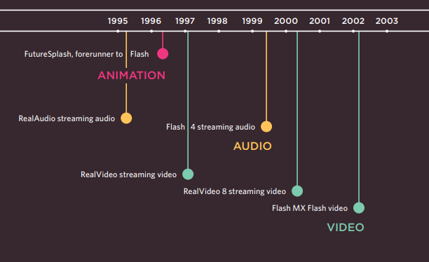
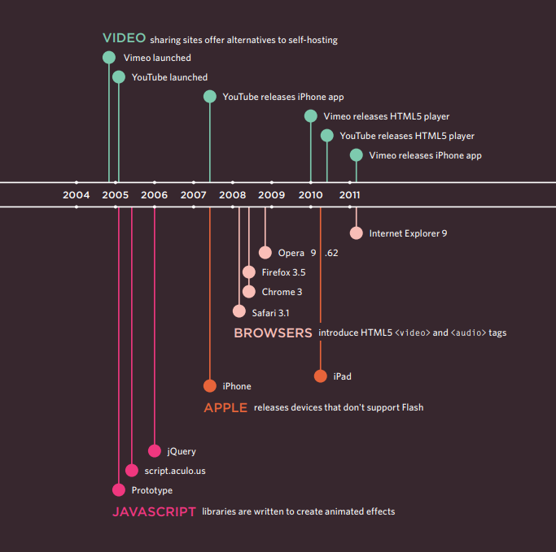

# Images

    Controlling the size and alignment of your images using CSS

## Controlling sizes of images in CSS

You can control the size of an image using the **width** and **height** properties in CSS, just like you can for any other box.

> This is very helpful when you use the same sized images on several pages of your site.

## AligNing images Using CSS

Images can be aligned both **horizontally** and **vertically** using CSS.

There are two ways :

1. *The float property is added to the class that was created to represent the size of the image.*

2. *New classes are created with names such as align-left or align-right to align the images to the left or right of the page.*

        Centering images Using CSS

> By default, images are inline elements. This means that they flow within the surrounding text. In order to center an image, it should be turned into a blocklevel element using the display property with a value of block.

There are two common ways in which you can horizontally center an image:

1. *On the containing element, you can use the text-align property with a value of center.*

2. *On the image itself, you can use the use the margin property and set the values of the left and right margins to auto.*

## Background Images

The background-image property allows you to place an image behind any HTML element. This could be the entire page or just part of the page. By default, a background image will repeat to fill the entire box.

> You can use a background image behind the box created by any element on a page.

## Repeating Images

> Background images can appear just once or be repeated across the background of the box.

The background-repeat property can have four values:

1. * repeat : The background image is repeated both horizontally and vertically.
        * repeat-x : The image is repeated horizontally only.
        * repeat-y : The image is repeated vertically only.

2. * no-repeat : The image is only shown once.

3. * fixed : The background image stays in the same position on the page.

4. * scroll : The background image moves up and down as the user scrolls up and down the page.

## Background Position

When an image is not being repeated, you can use the background-position property to specify where in the browser window the background image should be placed.

> You can create image rollover effects by moving the background position of an image.

## shorthand

The properties must be specified in the following order, but you can miss any value if you do not want to specify it.

1: background-color

2: background-image

3: background-repeat

4: background-attachment

5: background-position

> To reduce the number of images your browser has to
load, you can create image sprites.

## Contrast of background images

If you want to overlay text on a background image, the image must be low contrast in order for the text to be legible.

* High Contrast
* Low Contrast
* Screen

# Practical Information

Search engine optimization helps visitors find your sites when using search engines.

> Analytics tools such as Google Analytics allow you to see how many people visit your site, how they find it, and what they do when they get there.

        To put your site on the web, you will need to obtain a domain name and web hosting.

FTP programs allow you to transfer files from your local computer to your web server.

Many companies provide platforms for blogging, email newsletters, e-commerce and other popular website tools (to save you writing them from scratch).

# Flash, Video & Audio

Flash is a very popular technology used to add animations, video, and audio to websites.

Timeline: Flash, VidEo & Audio

Web technologies change quickly. Here you can see some of the changes in how animation, video, and audio are created on the web.

