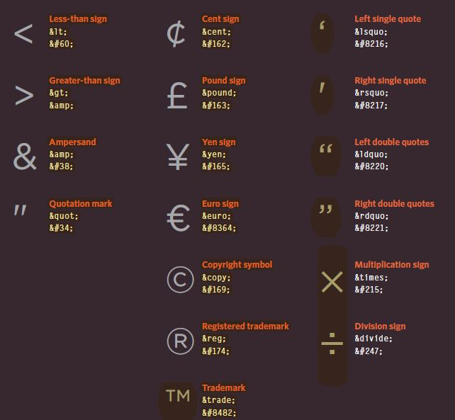
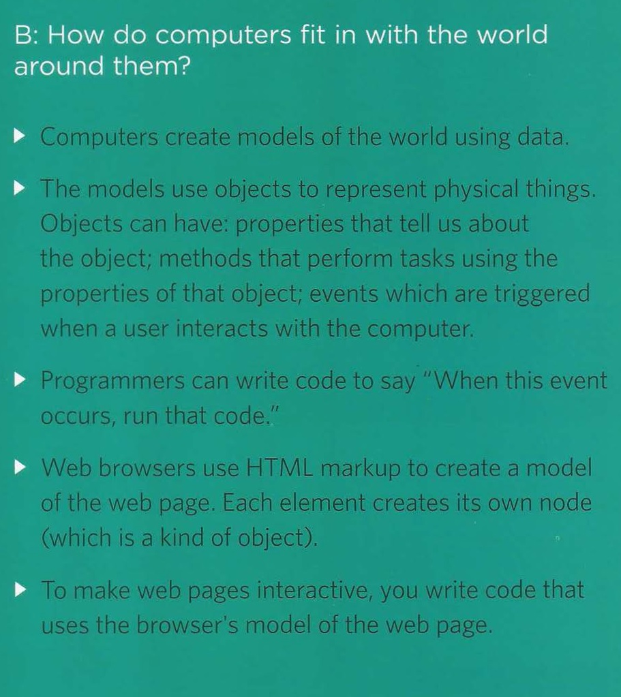
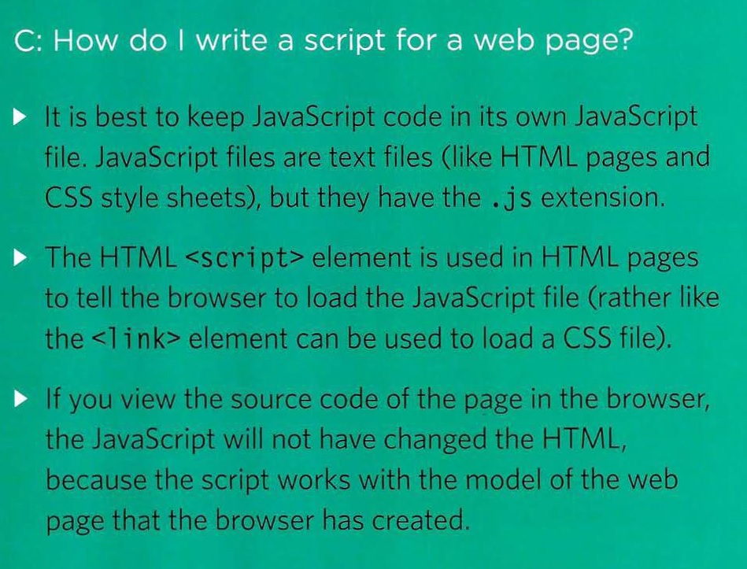

#  Introductory HTML and JavaScript

**HTML pages are text documents.**

* HTML Uses Elements to Describe the Structure of Pages
>Each element has an opening tag and a closing tag.

* Tags act like containers. They tell you something about the information that lies between their opening and closing tags.

Because there have been several versions of **HTML**, each web page should begin with a **DOCTYPE** declaration to tell a browser which version of **HTML** the page is using

1. *HTML 5*
><!DOCTYPE html>
2. *HTML 4*
><!DOCTYPE html PUBLIC "-//W3C//DTD HTML 4.01 Transitional//EN" "http://www.w3.org/TR/html4/loose.dtd">
3. *Transitional XHTML 1.0*
><!DOCTYPE html PUBLIC "-//W3C//DTD XHTML 1.0 Transitional//EN" "http://www.w3.org/TR/xhtml1/DTD/  xhtml1-transitional.dtd">
4. *Strict XHTML 1.0*
><!DOCTYPE html PUBLIC "-//W3C//DTD XHTML 1.0 Strict//EN" "http://www.w3.org/TR/xhtml1/DTD/  xhtml1-strict.dtd">
5. *XML Declaration*
><?xml version="1.0" ?>

* EXTRA MARKUP
  * The id and class attributes allow you to identify particular elements.
  * The 
 and  elements allow you to group block-level and inline elements together.
  * <iframes> cut windows into your web pages through which other pages can be displayed.
  * The <meta> tag allows you to supply all kinds of information about your web page.
  * Escape characters are used to include special characters in your pages such as <, >, and ©.
  > 

** The new HTML5 elements indicate the purpose of different parts of a web page and help to describe its structure. **

* The <header> and <footer> elements can be used for:
  * The main header or footer that appears at the top or bottom of every page on the site.
  * A header or footer for an individual <article> or <section> within the page.
* Navigation <nav>
  * The <nav> element is used to contain the major navigational blocks on the site such as the primary site navigation.
* Articles <article>
  * The <article> element acts as a container for any section of a page that could stand alone and potentially be syndicated.
* Sections <section>
  * The <section> element groups related content together, and typically each section would have its own heading.  

**It's important to understand who your target audience is, why they would come to your site, what information they want to find and when they are likely to return **
* WireFrames
  * A wireframe is a simple sketch of the key information that needs to go on each page of a site. It shows the hierarchy of the information and how much space it might require. 
  
>Wireframes allow you to organize the information that will need to go on each page.  

**The ABC of Programming**

* A : What is a script and how do I create one?
  * B : How do computers fit in with the world around them?
    * C : How do I write a script for a web page?

** A script is a series of instructions that a computer can follow to achieve a goal. **

** To write a script, you need to first state your goal and then list the tasks that need to be completed in order to achieve it. **

> Start with the big picture of what you want to achieve, and break that down into smaller steps. 

1.  DEFINE THE GOAL 
> First, you need to define the task you want to achieve.
2.  DESIGN THE SCRIPT 
> To design a script you split the goal out into a series of tasks. This can be represented using a flowchart. 
3.  CODE EACH STEP 
> Each of the steps needs to be written in a programming language that the compu ter understands.

