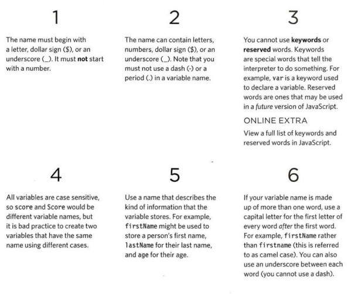

# JAVASCRIPT

A JavaScript file is just a text file (like HTML and CSS files are) but it has a ** . j s ** file extension, so save this file with the name add-content . j s 

#### ** LINKING TO A JAVASCRIPT FILE FROM AN HTML PAGE **

The HTML ** <script> ** element is used to load the ** JavaScript file ** into the page. It has an attribute called * src *, whose value is the path to the script you created. This tells the browser to find and load the ** script file (just like the src attribute on an <i mg> tag). **


##### THE SOURCE CODE IS NOT AMENDED

> The source of the web page does not actually show the new element that has been added into the page; it just shows the link to the JavaScript file. 


##### PLACING THE SCRIPT IN THE PAGE 

> You may see JavaScript in the HTML between opening <script> and closing </script> tags (but it is better to put scripts in their own files). 

#### ** JAVASCRIPT RUNS WHERE IT IS FOUND IN THE HTML **

When the browser comes across a <script> element, it stops to load the script and then checks to see if it needs to do anything. 

## ** Basic JavaScript Instructions **

A script is a series of instructions that a computer can follow one-by-one. Each individual instruction or step is known as a statement. Statements should end with a semicolon. 

> You should write ** comments ** to explain what your code does. They help make your code easier to read and understand. This can help you and others who read your code. 

* MULTI-LINE COMMENTS 
   * To write a ** comment ** that stretches over more than one line, you use a multi-line   comment, starting with the ```/* characters and ending with the */ ```characters. Anything between these characters is not processed· by the ** JavaScript ** interpreter.


* SINGLE-LINE COMMENTS 
   * In a single-line ** comment ** , anything that follows the two forward slash characters ```//``` on that line will not be processed by the JavaScript interpreter. Singleline comments are often used for short descriptions of what the code is doing.  

#### ** WHAT IS A VARIABLE? **

> A script will have to temporarily store the bits of information it needs to do its job. It can store this data in ** variables **. 

## * RULES FOR NAMING VARIABLES *

* Here are six rules you must always follow when giving a variable a name: 
  
